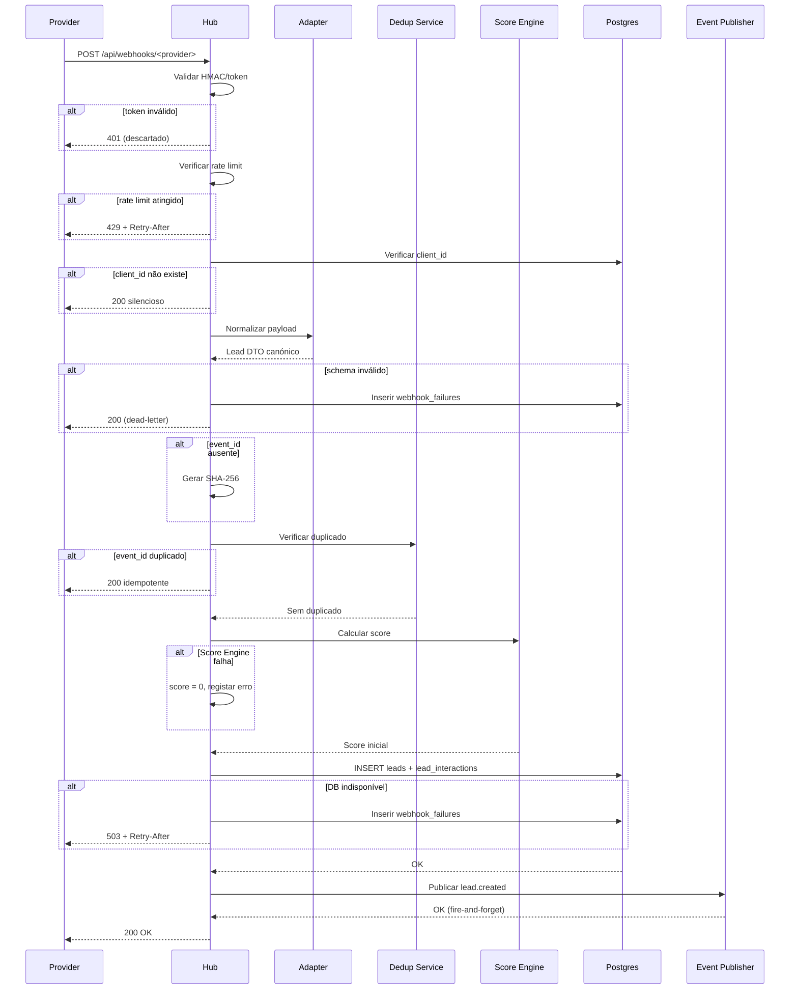
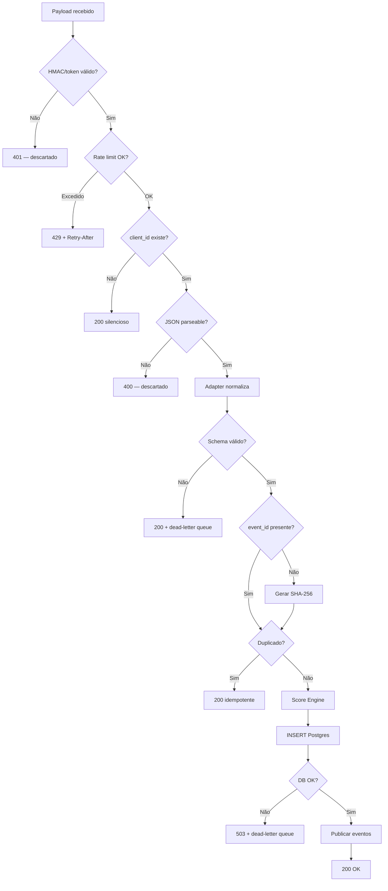
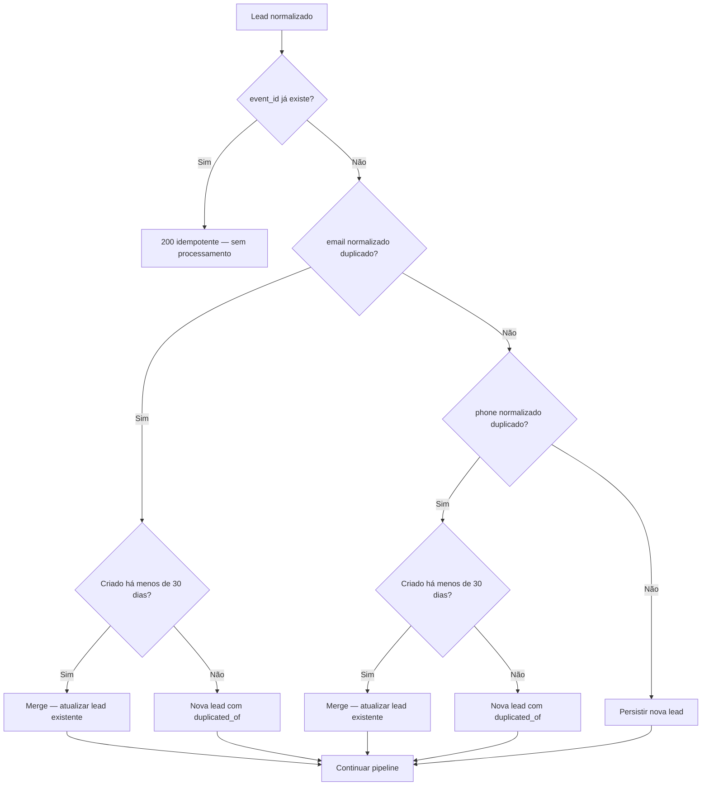
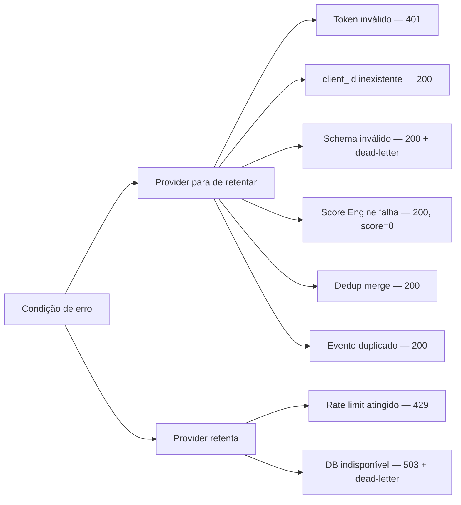
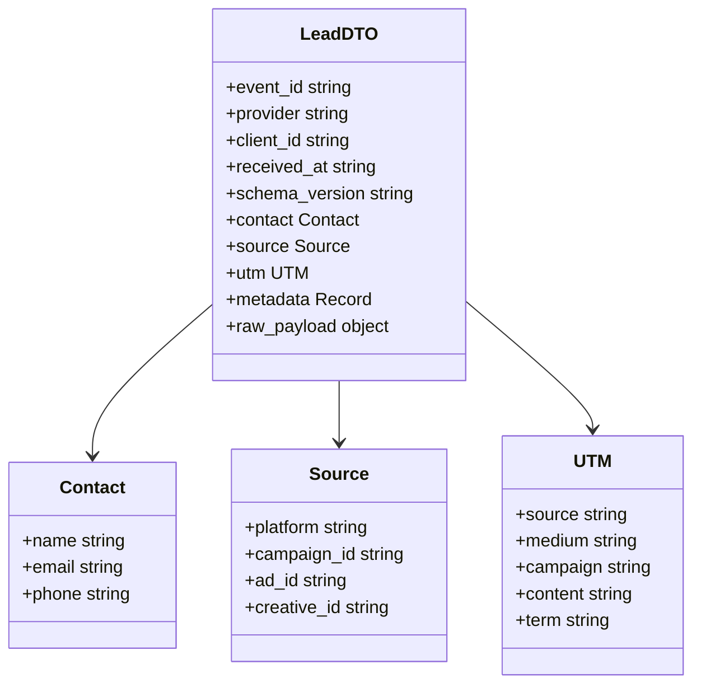
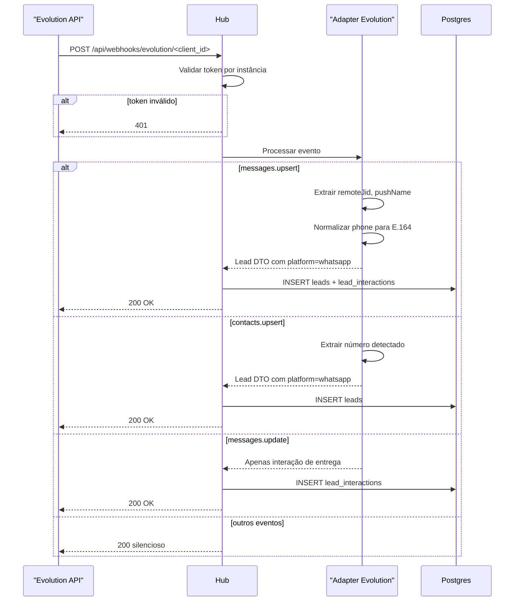
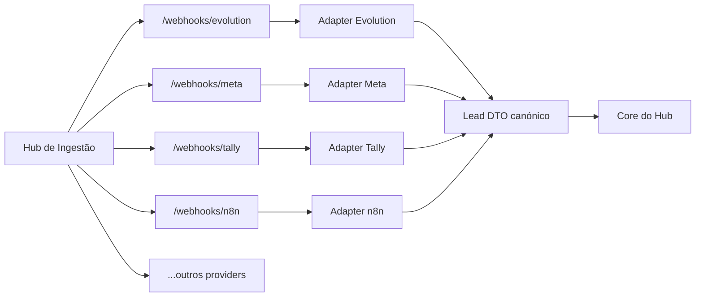
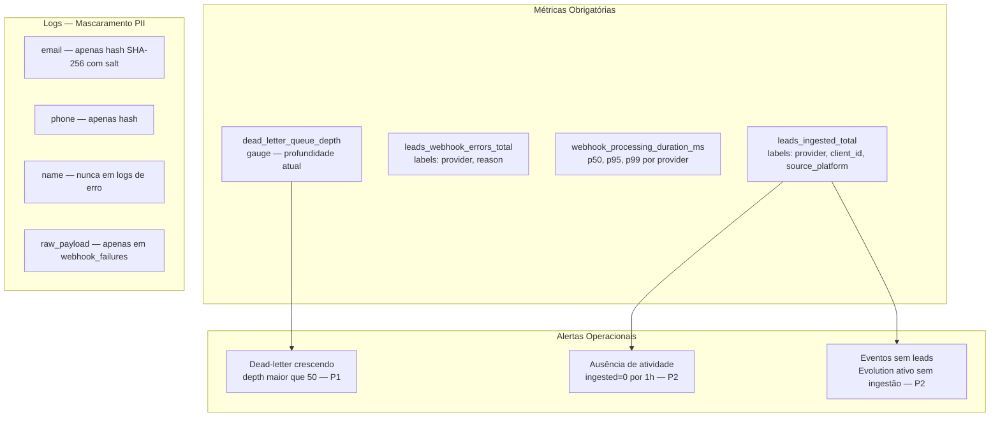

# Diagramas Mermaid — Hub Central de Ingestão de Leads

## Visão Geral

O Hub Central de Ingestão de Leads é o ponto único de entrada de todos os eventos de captação de leads no HypeFlow OS. Providers externos (Meta, Evolution API, Tally, Typeform, ManyChat, n8n) enviam eventos via HTTP para rotas dedicadas por provider, que são validados, normalizados para um Lead DTO canónico, deduplicados e persistidos no Postgres. O hub garante rastreabilidade de origem, isolamento total entre adapters e resiliência via dead-letter queue — nenhum lead é perdido silenciosamente. Consumidores internos (Score Engine, Automation Builder, Realtime Publisher) recebem o DTO canónico após persistência.

---

## Elementos Identificados

### Fluxos Externos

- Providers externos fazem `POST /api/webhooks/<provider>` com HMAC ou token de autenticação
- Hub retorna `200 OK` ao provider após persistência bem-sucedida
- Hub retorna `401` (token inválido), `429` (rate limit), `400` (JSON inválido), `503` (DB indisponível)
- Evolution API envia eventos `messages.upsert`, `contacts.upsert`, `messages.update` e outros
- Event Publisher notifica Automation Builder (fire-and-forget) e Realtime Publisher após persistência

### Processos Internos

- Validação HMAC/token antes de qualquer processamento
- Rate limiting: 100 req/min por IP, 1000 req/hora por agência
- Verificação de existência do `client_id` na DB
- Normalização do payload para Lead DTO canónico via adapter dedicado
- Geração de `event_id` interno (SHA-256) quando ausente no payload
- Deduplicação por `event_id` e por `(client_id, email_normalized)` / `(client_id, phone_normalized)`
- Regra de merge: duplicado com menos de 30 dias faz merge; com mais de 30 dias cria nova lead
- Score Engine calcula score inicial com política fail-open
- Transação Postgres: INSERT em `leads` e `lead_interactions`, derivação de `agency_id`
- Postgres trigger emite `NOTIFY lead.created`

### Variações de Comportamento

- Payload com schema inválido: 200 ao provider + dead-letter queue (não perde o payload)
- Payload JSON inválido (não parseable): 400, descartado permanentemente
- HMAC/token inválido: 401, descartado permanentemente (possível ataque)
- `client_id` inexistente: 200 silencioso, sem persistência, sem dead-letter
- Score Engine indisponível: fail-open, lead persiste com `score = 0`
- DB indisponível: 503 + `Retry-After` + payload para dead-letter
- Evento duplicado por `event_id`: 200 idempotente, sem processamento adicional
- Evolution API: eventos `messages.update` e todos os outros não mapeados retornam 200 silencioso

### Contratos Públicos

- Lead DTO canónico (TypeScript/Zod, `schema_version: 'v1'`)
- Endpoints: `POST /api/webhooks/<provider>`, `POST /api/webhooks/evolution/<client_id>`
- Dead-letter queue: tabela `webhook_failures` com campos `provider`, `client_id`, `agency_id`, `received_at`, `raw_payload`, `reason`, `attempt_count`
- Métricas obrigatórias: `leads_ingested_total`, `leads_webhook_errors_total`, `webhook_processing_duration_ms`, `dead_letter_queue_depth`

---

## Diagramas

### Fluxo Principal de Ingestão

Este diagrama de sequência ilustra o caminho completo de um evento de webhook desde a chegada ao hub até a confirmação ao provider. Representa o happy path com todos os componentes internos envolvidos na ordem exata em que são ativados: validação de autenticação, rate limiting, lookup de client_id, normalização pelo adapter, deduplicação, Score Engine, persistência em Postgres e publicação de eventos downstream. É o diagrama mais importante para compreender o comportamento central do sistema, incluindo as respostas de erro em cada etapa crítica.

**Notas**:
- A validação HMAC/token é sempre o primeiro passo — nenhum outro processamento ocorre antes
- O provider recebe 200 OK tanto em sucesso como em falhas geridas pelo hub (schema inválido, Score Engine indisponível)
- O provider recebe 4xx/5xx apenas quando o retry do provider é o comportamento correto (rate limit, DB indisponível)
- `agency_id` é derivado do `client_id` pelo hub na transação Postgres — nunca vem do provider
- Event Publisher usa fire-and-forget para Automation Builder e Realtime Publisher

---

### Pipeline de Decisão por Condição de Entrada

Este fluxograma detalha a árvore de decisão interna do hub para cada payload recebido, mapeando cada condição a uma ação e resposta HTTP específica. A complexidade deste diagrama justifica-se pelo número elevado de caminhos alternativos com semânticas distintas: alguns descartam silenciosamente, outros enviam para dead-letter, outros retornam erros que acionam retry no provider. Compreender este fluxo é essencial para implementar corretamente os critérios de aceite de segurança e resiliência.

**Notas**:
- Apenas HMAC/token inválido e JSON inválido resultam em descarte permanente sem dead-letter
- `client_id` inexistente retorna 200 silencioso para evitar vazamento de informação sobre client_ids válidos
- Schema inválido usa 200 (não 4xx) para que o provider pare de retentar — o hub gere o replay manualmente
- DB indisponível usa 503 para que o provider retente — o hub também persiste o payload na dead-letter

---

### Lógica de Deduplicação

Este fluxograma detalha o algoritmo de deduplicação em dois níveis que o hub aplica a cada lead normalizado. A primeira camada verifica idempotência por `event_id`; a segunda verifica unicidade por `(client_id, email_normalized)` e `(client_id, phone_normalized)`. A regra dos 30 dias — que distingue merge de criação de nova lead com referência à original — é a parte mais não-óbvia do sistema e está inteiramente contida neste diagrama.

**Notas**:
- A deduplicação por `event_id` é verificada primeiro — é a forma mais barata e definitiva
- A deduplicação por email/phone usa unique constraint composto `(client_id, email_normalized)` e `(client_id, phone_normalized)` no Postgres
- Merge significa atualizar os campos da lead existente, não criar um novo registo
- `metadata.duplicated_of` contém o `lead_id` original para rastreabilidade
- Deduplicação cross-client está excluída do escopo (E4)

---

### Estratégia de Resposta HTTP por Condição de Erro

Este fluxograma lateral compara as estratégias de resposta HTTP para cada condição de erro, organizadas pelo princípio unificador do hub: o provider retenta em 4xx/5xx e para em 2xx. Visualizar esta decisão como comparação lado a lado clarifica por que razão condições aparentemente problemáticas (schema inválido, Score Engine em falha) retornam 2xx — o hub assume a responsabilidade de gestão em vez de delegar ao provider.

**Notas**:
- O agrupamento reflete o princípio de design: o hub assume a gestão de falhas que ele próprio consegue resolver
- 401 é exceção ao padrão 2xx porque representa possível ataque — o payload é descartado permanentemente
- Schema inválido e DB indisponível são os únicos casos que alimentam a dead-letter queue
- Rate limit e DB indisponível incluem header `Retry-After` na resposta

---

### Lead DTO Canónico

Este diagrama de classes descreve o contrato universal de ingestão que todos os adapters devem produzir. É o contrato público mais importante do hub — qualquer provider que queira integrar deve normalizar o seu payload para este DTO antes de qualquer processamento downstream. O diagrama mostra os tipos e a obrigatoriedade de cada campo, bem como as relações entre as estruturas que compõem o DTO.

**Notas**:
- `source.platform` é o único campo explicitamente obrigatório em todos os adapters — adapter que não o determina falha em validação no CI
- `event_id` é gerado pelo hub (SHA-256) quando ausente no payload do provider
- `contact.email` e `contact.phone` são normalizados (lowercase + trim para email; E.164 via libphonenumber-js para phone)
- `raw_payload` é persistido na DB mas nunca exposto em logs — é PII protegida
- `metadata` armazena campos específicos do provider sem equivalente canónico
- `schema_version: 'v1'` permite coexistência futura com v2 em paralelo

---

### Adapter Evolution API — Mapeamento de Eventos

Este diagrama de sequência descreve o comportamento específico do adapter Evolution API, o provider primário de WhatsApp. Ao contrário dos outros providers, o Evolution envia múltiplos tipos de eventos com semânticas distintas: alguns criam leads, outros apenas registam interações, e a maioria é ignorada silenciosamente. Este diagrama clarifica quais eventos acionam processamento real versus quais retornam 200 silencioso, incluindo o fluxo de autenticação por token por instância.

**Notas**:
- O token é fixo por instância Evolution e armazenado no Supabase Vault — token global é proibido
- `client_id` vem no path da URL (`/evolution/<client_id>`) — a agência configura a URL no painel Evolution
- `messages.update` regista apenas `lead_interaction` de status de entrega — não cria nem atualiza lead
- Todos os eventos não mapeados retornam 200 silencioso sem dead-letter queue
- Evolution API corre no VPS do cliente (self-hosted) — não é infraestrutura da Meta

---

### Isolamento entre Adapters

Este fluxograma lateral ilustra a decisão arquitetural central de isolamento por rota: cada provider tem a sua própria rota e adapter dedicados, de modo que a falha de um adapter não afeta o processamento dos outros. É um princípio inegociável do hub (H7) e concretiza o objetivo de que um novo provider seja integrado implementando apenas o seu adapter sem alterar o core nem os adapters existentes.

**Notas**:
- Cada rota tem o seu próprio adapter com autenticação independente (token ou HMAC por provider)
- Falha no adapter de um provider (erro de parsing, token expirado) não propaga para os outros
- Novo provider: implementar apenas o adapter e registar a rota — sem alterar `Core do Hub`
- GHL é adapter opcional — o hub funciona sem ele (E8 do escopo)
- Todos os adapters convergem para o mesmo Lead DTO canónico antes do processamento downstream

---

### Observabilidade e Alertas

Este fluxograma descreve o sistema de observabilidade obrigatório para go-live, organizando as quatro métricas mandatórias, as regras de mascaramento de PII nos logs e os três alertas operacionais com as suas condições de disparo e severidade. A observabilidade neste hub vai além de monitorizar erros — monitoriza também a ausência de atividade esperada, o que é igualmente crítico para campanhas pagas.

**Notas**:
- Alerta P1 (`dead_letter_queue_depth > 50`) acorda equipa às 3h — leads de campanhas pagas a falhar
- Alerta P2 de ausência de atividade monitoriza `leads_ingested_total = 0` por 1h em horário comercial por instância Evolution
- Alerta P2 de eventos sem leads deteta `client_id` mal configurado no Evolution (R6)
- `correlation_id` é propagado de todos os spans: `webhook.receive`, `webhook.auth`, `webhook.ratelimit`, `webhook.adapt`, `webhook.dedup`, `webhook.score`, `webhook.persist`, `webhook.publish`
- Amostragem de tracing: 100% de erros e dead-letter events, 10% de requests OK
